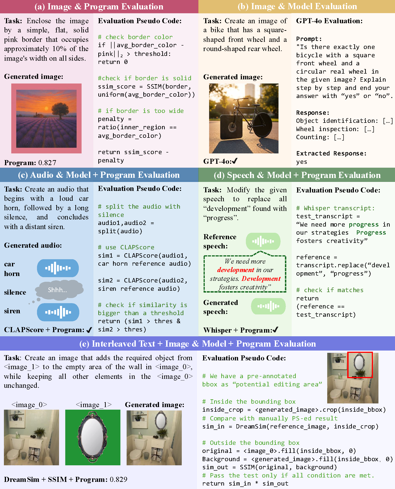

# MMMG Benchmark

[**🏆 Leaderboard** (coming soon)]() | [**🤗 MMMG**](https://huggingface.co/datasets/UW-FMRL2/MMMG) | [**📖 Paper**]()

This repo contains the evaluation pipeline for the paper "[MMMU-Pro: A More Robust Multi-discipline Multimodal Understanding Benchmark]()".

[//]: # (## 🔔News)

[//]: # ()
[//]: # (- **🔥[2024-09-05] Introducing [MMMU-Pro]&#40;https://arxiv.org/abs/2409.02813&#41;, a robust version of MMMU benchmark for multimodal AI evaluation! 🚀**)

[//]: # (- **🚀[2024-01-31]: We added Human Expert performance on the [Leaderboard]&#40;https://mmmu-benchmark.github.io/#leaderboard&#41;!🌟**)

[//]: # (- **🔥[2023-12-04]: Our evaluation server for test set is now availble on [EvalAI]&#40;https://eval.ai/web/challenges/challenge-page/2179/overview&#41;. We welcome all submissions and look forward to your participation! 😆**)

## Introduction

Automatically evaluating multimodal generation presents a significant challenge, as automated metrics often struggle to align reliably with human evaluation, especially for complex tasks that involve multiple modalities. To address this, we present MMMG, a comprehensive and human-aligned benchmark for multimodal generation across 4 modality combinations (image, audio, interleaved text and image, interleaved text and audio), with a focus on tasks that present significant challenges for generation models, while still enabling reliable automatic evaluation through a combination of models and programs. MMMG encompasses 49 tasks (including 29 newly developed ones), each with a carefully designed evaluation pipeline, and 937 instructions to systematically assess reasoning, controllability, and other key capabilities of multimodal generation models. Extensive validation demonstrates that MMMG is highly aligned with human evaluation, achieving an average agreement of 94.3%. Benchmarking results on 24 multimodal generation models reveal that even though the state-of-the-art model, GPT Image, achieves 78.3% accuracy for image generation, it falls short on multimodal reasoning and interleaved generation. Furthermore, results suggest considerable headroom for improvement in audio generation, highlighting an important direction for future research.



## Evaluation

We provide two ways of using MMMG evaluation suite. Choose the most convenient way for yourself.
### Interface
We recommend using MMMG along within your model's conda environment if there is no version conflict. For all required packages, only openai>=1.76.0, google-genai>=1.10.0, transformers>=4.34.0 and evaluate>=0.2.0 have required lowest versions. Typically, MMMG is compatible with your model environment unless you implement models before 2023.
```bash
# python >= 3.9 is required
conda activate your_env
pip install -r requirements.txt --upgrade-strategy only-if-needed
```
After, implement the `generate` function for your model in `model_customized.py`. Make sure you strictly follow the format requirement. To test your model on MMMG, you should apply for [OpenAI API key](https://platform.openai.com/api-keys) and [Gemini API key](https://ai.google.dev/gemini-api/docs/api-key) and then run
```bash
export OPENAI_KEY=openai_key
export GEMINI_KEY=gemini_key
python eval_pipeline.py --model_name model_name --category category
# model_name is the same name as your implemented model class name in model_customized.py
# category can be one of i, it, a, at, representing image, interleaved image-text, sound + music and speech + interleaved speech-text generation.
```
You can also manually add your API keys at Line 22-23 in `utils.py` to permanently preserve the API keys.

---
If your model's environment happen to conflict with MMMG's requirement, here is an alternative solution.
```bash
conda activate your_env
pip install -r requirements_light.txt --upgrade-strategy only-if-needed
```
Implement the `generate` function for your model in `model_customized.py`. And then run:
```bash
python eval_pipeline.py --model_name model_name --category category --job none
```
Then create a conda environment for MMMG by:
```bash
conda create --name mmmg python=3.9
conda activate mmmg
pip install -r requirements.txt
export OPENAI_KEY=openai_key
export GEMINI_KEY=gemini_key
python eval_pipeline.py --model_name model_name --category category
```
This process separate generation and evaluation stages to avoid package conflicts.
### Package
coming soon
## Contact
- Jihan Yao: jihany2@cs.washington.edu
- Yushi Hu: yushihu@uw.edu

## Citation

**BibTeX:**
```bibtex
comming soon
```